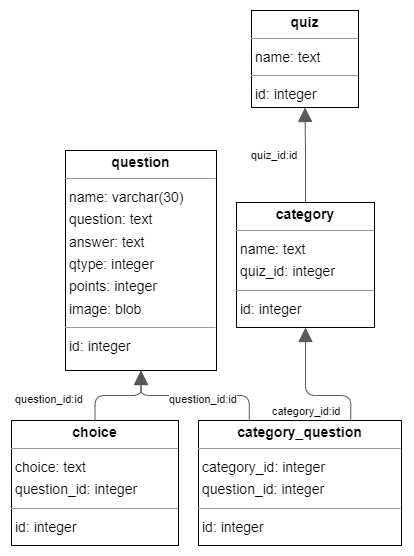

# Quizzies

Quizzies is a desktop application for all trivia quiz lovers which allows them to create and showcase their quizzes.

## Setup

Requirements:
- [Python 3.9](https://www.python.org/downloads/release/python-396/)
- [Qt 6.2.3](https://www.qt.io/download-qt-installer)

**Note:** you might want to initialize a Python [virtual environment](https://docs.python.org/3/tutorial/venv.html).

To start the application, position yourself inside the `src/` folder and run:
```
pip install pyside6
pyside6-rcc res.qrc > qrc.py
python main.py
```

## User guide

On the home screen, you can choose to create your quiz or select one of the existing quizzes. All the quizzes you create and the few default ones are displayed in a list, and you can either view them, edit them or delete them.


Pressing the *Play* button will open the selected quiz in Presentation mode. This is a tool that you can use when your group of friends gathers around (live or online) to answer all the questions you, the trivia king, collected and are now presenting to them. All the categories and questions will be previewed, as you press the *Previous* and *Next* buttons at the bottom of the screen.

In the top left corner, there is a *Back* button to get you to the home screen.


Pressing the *Add* or *Edit* buttons will open the edit page. On the left side of the screen, there is a list of all the categories and questions in your quiz. You can add new ones or delete the ones you don't like.

Click on the category to expand it.

Click on the question to view the details section on the right side of the screen. You can edit the question, its short description, answer, or the number of points, just remember to save your changes.

Right-click on the category to change its name and press *Enter* to save 
the changes.

In the top right corner, you can edit the quiz name using right-click and pressing *Enter* to save the changes.

In the top left corner, there is a *Back* button to get you to the home screen.


## The code

### The database

Starting the app will initialize the connection to an SQLite database by opening the `src\db.sqlite3` file. If the file doesn't exist, it will be created, and all the necessary SQL tables will be added, along with two example quizzes. The changes you make to your quizzes update the database, they are persistent and will be visible if you close and reopen the app.

The app uses the [Qt SQL module](https://doc.qt.io/qt-6/qtsql-index.html), specifically the SQL API Layer to interact with the database.

Database schema:


### The models (Model/View Architecture)

Two models are implemented in the Quizzies app:

- QuizListModel:
  - inherited from [QAbstractListModel](https://doc.qt.io/qt-6/qabstractlistmodel.html)
  - used on the home screen
  - contains the list of all the quizzes
  - contains slots for creating, updating, deleting quizzes and fetching details (categories and questions)
  - overrides methods `data`, `insertRow` and `removeRow`


- CategoriesTreeModel:
  - inherited from [QAbstractItemModel](https://doc.qt.io/qt-6/qabstractitemmodel.html)
  - used on the edit page for displaying the quiz' categories and questions and on the presentation screen for displaying the current category or question
  - contains the current (selected) quiz
  - contains slots for creating, updating and deleting categories and questions, navigating through them (getting the previous or next     element), and getting the desired element as a dictionary
  - overrides methods `rowCount`, `index`, `parent`,
    `data`, `insertRow`, `removeRow` and `setData`

## Future steps


